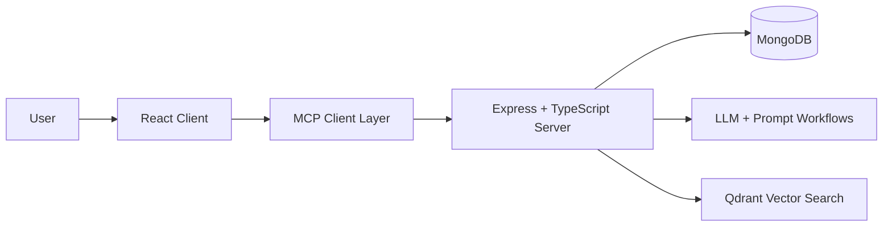
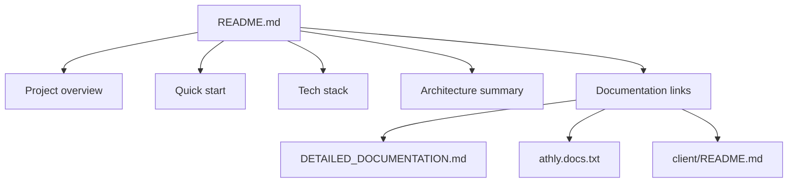
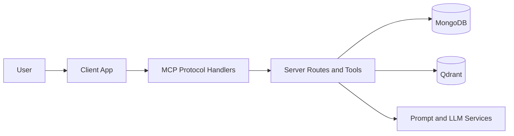

# Athly README Guide

This file documents what a strong project README should contain and provides an Athly-specific structure you can reuse for the root repository README.

## Why a README matters

A good README is the project cover page for developers, recruiters, and collaborators. It should:

- explain what the project does
- show how to install and run it
- communicate the tech stack and architecture quickly
- point readers to deeper documentation when they need more detail

GitHub and GitLab automatically render a root `README.md`, so it is usually the first thing someone sees when they open the repository.

## Athly at a glance

Athly is an AI-assisted fitness coaching platform that combines a React client, a TypeScript/Express backend, MongoDB persistence, and Model Context Protocol (MCP) workflows for tool-driven workout planning.



## Recommended root README structure

Use a short, clear root README and move long-form material into dedicated documentation files.



## How to create one

In VS Code:

1. Right-click the project root.
2. Create a new file named `README.md`.
3. Write it in Markdown.
4. Keep the overview concise and link to detailed docs for everything else.

In a terminal:

```bash
touch README.md
```

## Example root README for Athly

The following is a practical starting point for this repository.

```md
# Athly

Athly is an AI-powered workout coaching platform that helps users generate personalized training plans, track exercise preferences, and interact with a tool-enabled assistant through the Model Context Protocol (MCP).

## What it does

- generates structured workout plans
- searches and maps exercises from internal datasets
- tracks user exercise preferences and progression
- combines prompt workflows with server-side tools for safer, more consistent AI behavior

## Tech Stack

- Frontend: React 19, TypeScript, Vite, React Router, TanStack Query, Tailwind CSS
- Backend: Node.js, Express, TypeScript
- Database: MongoDB with Mongoose
- AI and tooling: MCP SDK, Google Generative AI / Vertex AI, Qdrant, Zod

## Architecture



## Installation

1. Clone the repository.

   ```bash
   git clone https://github.com/your-username/athly.git
   cd athly
   ```

2. Install dependencies.

   ```bash
   npm install
   ```

3. Configure environment variables for the server.

4. Start the backend.

   ```bash
   npm run dev:server
   ```

5. Start the frontend.

   ```bash
   npm run dev:client
   ```

## Available scripts

- `npm run dev` starts the server workspace default dev command
- `npm run dev:server` runs the backend in watch mode
- `npm run dev:client` starts the Vite frontend
- `npm test` runs the test suite from the workspace root

## Documentation

- [Detailed Documentation](./DETAILED_DOCUMENTATION.md)
- [Project Notes](./athly.docs.txt)
- [Client Notes](./client/README.md)

## Who this project is for

- developers evaluating the codebase
- recruiters reviewing technical breadth and architecture
- collaborators onboarding into the MCP-driven workflow
```

## Suggested documentation split as the project grows

Once the repository grows, keep the main README focused and move detailed topics into dedicated documents.

```text
project-root/
|
|-- README.md                    overview + quick start
|-- DETAILED_DOCUMENTATION.md    architecture and implementation details
|-- athly.docs.txt               additional notes and reference material
|-- client/
|   |-- README.md                frontend-specific notes
|-- server/
|   |-- src/
```

## Documentation links to keep in the root README

- [Detailed Documentation](../DETAILED_DOCUMENTATION.md)
- [Project Notes](../athly.docs.txt)
- [Client README](../client/README.md)

## Guidance for recruiters and developers

For recruiters, the most useful sections are the project summary, tech stack, and architecture snapshot. For developers, the most useful sections are installation, scripts, and links to deeper documentation.

The most effective README is short enough to scan in under two minutes, but specific enough that someone can understand the product, the stack, and how to run it without opening five other files first.