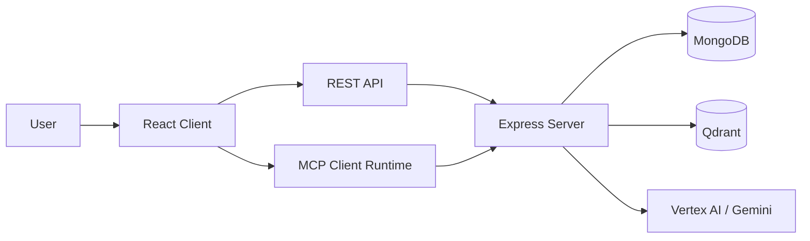

# Athly

Athly is an AI-assisted fitness coaching platform that generates personalized workout plans, tracks exercise preferences and progression, and connects a React client to validated backend tools through the Model Context Protocol (MCP).

The project is built as a full-stack TypeScript workspace with a Vite frontend, an Express backend, MongoDB persistence, Vertex AI integration, and Qdrant-powered semantic exercise search.

## Overview

Athly is designed to keep workout generation structured instead of relying on free-form model output alone. The backend exposes tools and prompts that the model can call through MCP, while the client renders those tool-driven interactions and authenticated workout flows.

Core capabilities:

- generate personalized workout plans from user profile data and training frequency
- recommend exercise replacements using semantic search and fallback ranking
- track user exercise targets, preferences, and progression data
- support prompt-driven coaching flows backed by validated server-side tools
- combine REST endpoints and MCP transport in one application

## Stack

- Frontend: React 19, TypeScript, Vite, React Router, TanStack Query, Tailwind CSS
- Backend: Node.js, Express, TypeScript
- Data: MongoDB with Mongoose
- AI: Vertex AI / Gemini, MCP SDK, Zod
- Retrieval: Qdrant vector search for exercise lookup and replacement

## Architecture



## Main Flows

1. A user signs up, logs in, and stores profile data such as training days, available equipment, and preferences.
2. The frontend boots the MCP client runtime and loads the tool registry exposed by the server.
3. Workout requests go through prompt-driven AI flows that can call structured backend tools.
4. Generated workouts are persisted and later retrieved through authenticated REST endpoints.
5. Exercise replacement requests use embeddings and Qdrant search, with MongoDB-based fallback ranking when needed.

## Repository Layout

```text
athly/
|-- client/                    React app, routing, auth state, MCP-aware UI
|-- server/                    Express API, MCP server, prompts, tools, AI services
|-- docs/                      Setup, API, architecture, changelog, decisions
|-- DETAILED_DOCUMENTATION.md  Extended implementation notes
|-- athly.docs.txt             Supplemental project notes
|-- docker-compose.yml         Local Qdrant service
```

## Quick Start

### Prerequisites

- Node.js 20+
- npm 10+
- MongoDB
- Docker Desktop or another Docker runtime
- Google Cloud / Vertex AI credentials if you want AI-enabled flows

### 1. Install dependencies

```bash
npm install
```

### 2. Configure environment variables

Create a root `.env` file:

```env
MONGODB_URI=mongodb://127.0.0.1:27017/athly
PORT=3000
HOST=127.0.0.1
FRONTEND_ORIGIN=http://localhost:5173
MCP_PATH=/mcp
MCP_TRANSPORT=http

JWT_SIGNTOKEN_SECRET=replace-me
JWT_REFRESHTOKEN_SECRET=replace-me-too
JWT_SIGNTOKEN_EXPIRESIN=15m
JWT_SIGNCOOKIE_EXPIRESIN=15
JWT_REFRESHTOKEN_EXPIRESIN=90d
JWT_REFRESH_COOKIE_EXPIRESIN=90

VERTEX_AI_PROJECT=your-gcp-project
VERTEX_AI_LOCATION=europe-west4

QDRANT_URL=http://127.0.0.1:6333
QDRANT_COLLECTION=athly_exercises
```

Optional client overrides can go in `client/.env`:

```env
VITE_API_BASE_URL=http://127.0.0.1:3000
VITE_MCP_PATH=/mcp
VITE_MCP_ROOTS=./user-data,./workouts
```

### 3. Start local services

Start Qdrant:

```bash
docker compose up -d
```

Start the backend:

```bash
npm run dev:server
```

Start the frontend:

```bash
npm run dev:client
```

Default local URLs:

- frontend: `http://localhost:5173`
- backend: `http://127.0.0.1:3000`
- Qdrant: `http://127.0.0.1:6333`

## Scripts

- `npm run dev` runs the server workspace dev command
- `npm run dev:server` starts the backend in watch mode
- `npm run dev:client` starts the frontend
- `npm start` runs the server workspace start command
- `npm test` runs the workspace test suite
- `npm run ai:index:qdrant --workspace=server` indexes exercise data into Qdrant
- `npm run ai:verify:qdrant --workspace=server` verifies Qdrant indexing
- `npm run ai:search:qdrant --workspace=server` runs a local search check against Qdrant

## API Surface

The backend exposes both REST routes and an MCP endpoint.

Notable REST routes:

- `POST /auth/signup`
- `POST /auth/login`
- `POST /auth/logout`
- `POST /auth/refresh`
- `PATCH /auth/profile`
- `POST /llm/message`
- `GET /workouts`
- `POST /workouts/replace-exercise`

MCP transport is mounted at `/mcp` and registers tools for workouts, exercises, user preferences, progression, and prompt workflows.

## Development Notes

- Keep `localhost` and `127.0.0.1` usage consistent during local development because auth relies on cookies.
- Qdrant-backed replacement quality depends on indexing the exercise dataset first.
- Some flows can fall back to MongoDB ranking when vector search is unavailable.
- The repository uses npm workspaces for `client` and `server`.

## Documentation

- [Setup Guide](docs/setup.md)
- [API Reference](docs/api.md)
- [Architecture Overview](docs/architecture.md)
- [Changelog](docs/changelog.md)
- [Engineering Decisions](docs/decisions.md)
- [Detailed Documentation](DETAILED_DOCUMENTATION.md)
- [Project Notes](athly.docs.txt)

## Why This Repo Is Interesting

Athly is not just a standard CRUD fitness app. The main technical interest is the combination of:

- a React client that can render MCP-driven interactions dynamically
- an Express backend that exposes both REST and MCP transports
- prompt and tool separation for safer AI orchestration
- semantic exercise retrieval backed by Qdrant and embeddings
- authenticated user-specific workout generation and tracking flows