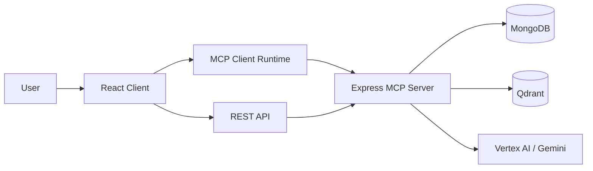
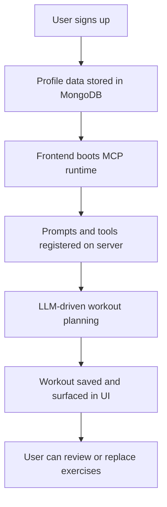

# Athly

Athly is an AI-assisted fitness coaching platform that generates personalized workout plans, tracks exercise preferences, and combines prompt-driven workflows with server-side tools through the Model Context Protocol (MCP).

## What This Project Does

- creates structured workout plans based on user profile data and training goals
- searches and maps exercises from the internal exercise dataset
- tracks user exercise preferences, targets, and progression
- blends a React client with an MCP-enabled TypeScript backend so AI flows can call validated tools instead of relying on free-form model output alone

## Tech Stack

- Frontend: React 19, TypeScript, Vite, React Router, TanStack Query, Tailwind CSS
- Backend: Node.js, Express, TypeScript
- Database: MongoDB with Mongoose
- AI and orchestration: MCP SDK, Vertex AI / Gemini, Zod
- Search and retrieval: Qdrant vector search for exercise replacement and retrieval workflows

## Architecture Snapshot



## Quick Start

### 1. Install dependencies

```bash
npm install
```

### 2. Configure environment variables

Create a root `.env` file for the server. At minimum, Athly expects:

```env
MONGODB_URI=mongodb://127.0.0.1:27017/athly
PORT=3000
HOST=127.0.0.1
FRONTEND_ORIGIN=http://localhost:5173
MCP_PATH=/mcp
MCP_TRANSPORT=http

JWT_SIGNTOKEN_SECRET=replace-me
JWT_REFRESHTOKEN_SECRET=replace-me-too
JWT_SIGNTOKEN_EXPIRESIN=15m
JWT_SIGNCOOKIE_EXPIRESIN=15
JWT_REFRESHTOKEN_EXPIRESIN=90d
JWT_REFRESH_COOKIE_EXPIRESIN=90

VERTEX_AI_PROJECT=your-gcp-project
VERTEX_AI_LOCATION=europe-west4

QDRANT_URL=http://127.0.0.1:6333
QDRANT_COLLECTION=athly_exercises
```

For the client, create `client/.env` if you need to override defaults:

```env
VITE_API_BASE_URL=http://127.0.0.1:3000
VITE_MCP_PATH=/mcp
VITE_MCP_ROOTS=./user-data,./workouts
```

### 3. Start Qdrant

```bash
docker compose up -d
```

### 4. Start the backend

```bash
npm run dev:server
```

### 5. Start the frontend

```bash
npm run dev:client
```

The frontend runs on `http://localhost:5173` and the server defaults to `http://127.0.0.1:3000`.

## Available Scripts

- `npm run dev` runs the server workspace default dev command
- `npm run dev:server` starts the backend in watch mode
- `npm run dev:client` starts the Vite frontend
- `npm start` runs the server workspace start command
- `npm test` runs the workspace test suite
- `npm run ai:index:qdrant --workspace=server` indexes exercises into Qdrant
- `npm run ai:verify:qdrant --workspace=server` verifies Qdrant indexing

## Main User Flows



## Project Structure

```text
athly/
|-- client/                 React app and MCP-aware UI
|-- server/                 Express API, MCP server, prompts, tools, data logic
|-- docs/                   Setup, API, architecture, changelog, decisions
|-- DETAILED_DOCUMENTATION.md
|-- athly.docs.txt
|-- docker-compose.yml      Local Qdrant service
```

## Documentation

- [Setup Guide](docs/setup.md)
- [API Reference](docs/api.md)
- [Architecture Overview](docs/architecture.md)
- [Changelog](docs/changelog.md)
- [Engineering Decisions](docs/decisions.md)
- [Detailed Documentation](DETAILED_DOCUMENTATION.md)
- [Project Notes](athly.docs.txt)
- [Client README](client/README.md)
- [README Instructions](.github/README_INSTRUCTIONS.md)

## Why This README Exists

For recruiters, this repository shows full-stack TypeScript work across frontend, backend, authentication, AI integration, and vector search.

For developers, this README is the short entry point. The detailed implementation notes live in the documents linked above so the overview stays readable.