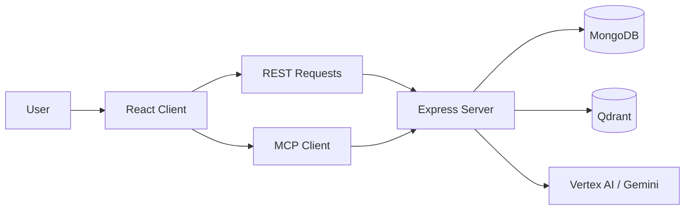
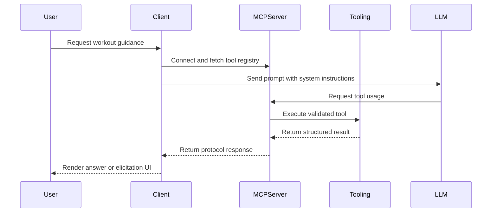

# Architecture Overview

Athly is organized as a workspace with separate client and server packages and a documentation layer at the repository root.

## High-Level System



## Repository Layout

```text
client/
  src/
    components/
    core/
    hooks/
    state/
    views/

server/
  src/
    database/
    domain/
    middleware/
    prompts/
    routes/
    services/
    tools/

docs/
  setup.md
  api.md
  architecture.md
  changelog.md
  decisions.md
```

## Frontend Responsibilities

The frontend is a React 19 application bootstrapped with Vite.

Primary responsibilities:

- route handling for home, login, signup, profile, and workouts views
- auth session state management
- MCP client bootstrapping and tool registry refresh
- rendering elicitation and approval UI for MCP flows
- calling REST endpoints for auth and workout data

Important implementation points:

- the client runtime initializes the MCP client before tool-driven interactions begin
- connection settings are centralized in `client/src/config/connectionConfig.ts`
- protected routes gate authenticated views such as workouts and profile

## Backend Responsibilities

The backend runs an Express app that serves both REST routes and an MCP transport.

Primary responsibilities:

- JWT cookie auth
- user profile and workout persistence with MongoDB
- MCP tool and prompt registration
- Vertex AI-backed LLM routing
- embeddings and Qdrant retrieval for exercise replacement flows

Important implementation points:

- the server starts by validating environment state and connecting to MongoDB
- MCP is exposed through a streamable HTTP transport
- in development, MCP auth may be bypassed through environment flags
- CORS is configured to support the local frontend while preserving credentialed requests

## MCP Flow



## Data and Search Layers

### MongoDB

MongoDB stores:

- users and profile state
- user exercises and targets
- workouts and workout exercises
- exercise catalog data

### Qdrant

Qdrant supports vector search workflows, especially exercise replacement and semantic retrieval.

When Qdrant search fails, parts of the backend fall back to MongoDB-based ranking so the feature degrades more gracefully.

## Prompt and Tool Design

The project separates prompt definitions from tool implementations.

- prompts define the coaching and workflow behavior expected from the model
- tools expose safe, structured operations over workouts, exercises, user preferences, and progress

This architecture keeps the model on a narrower path and reduces the chance of free-form outputs drifting away from the data model.